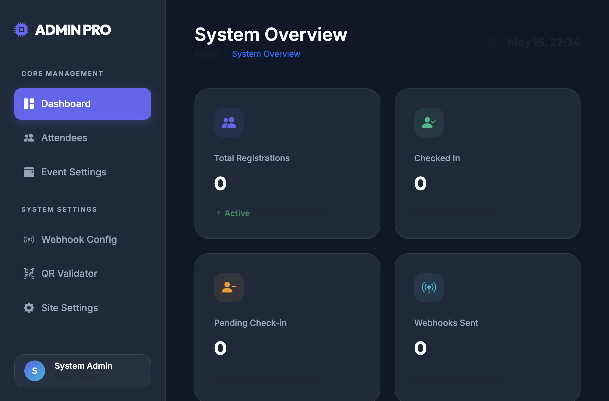
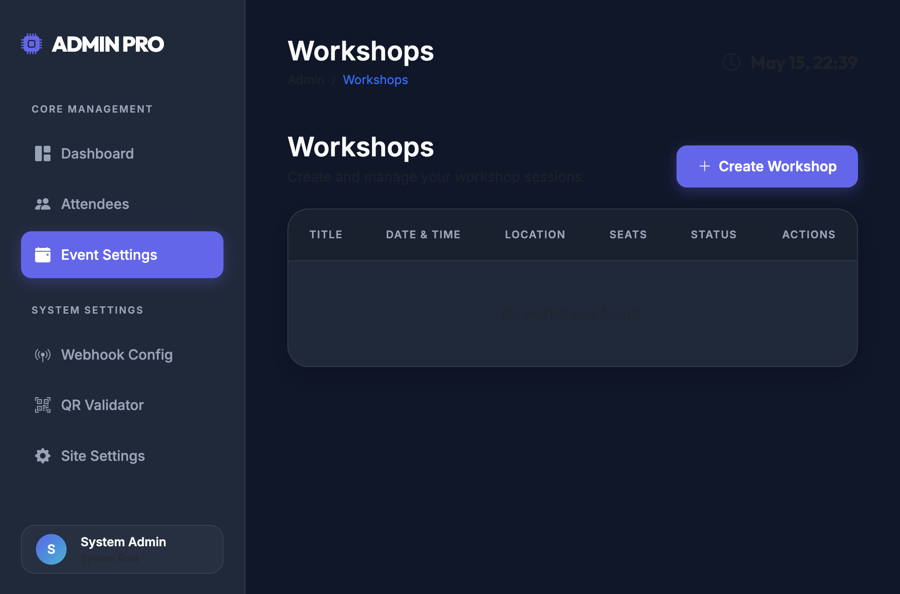
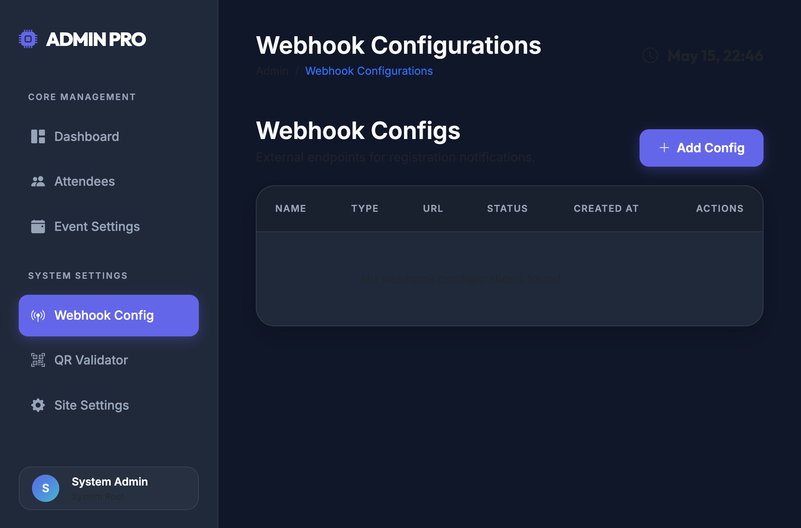
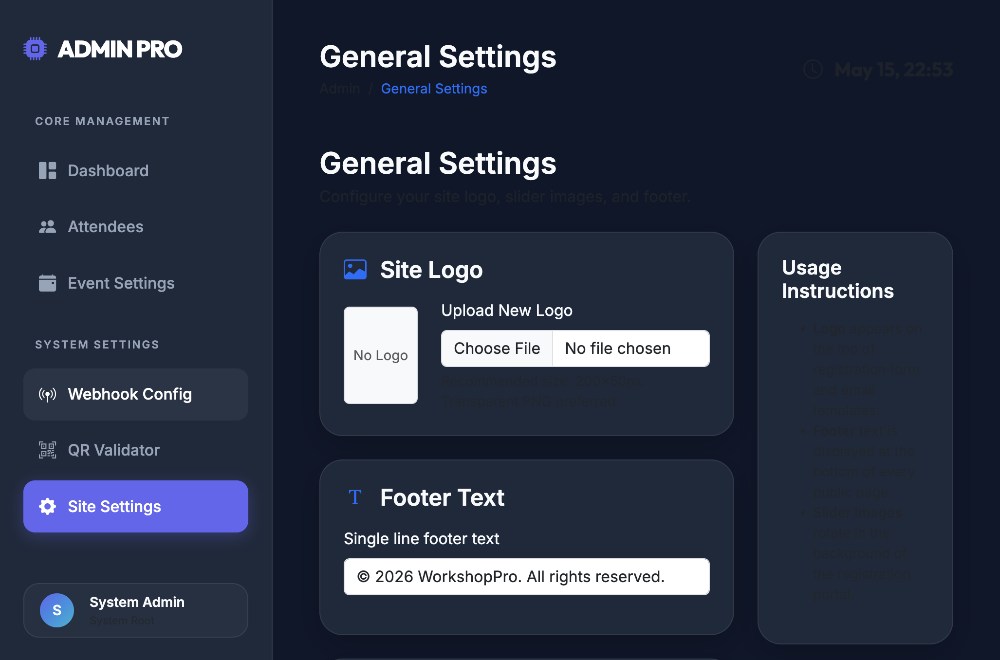
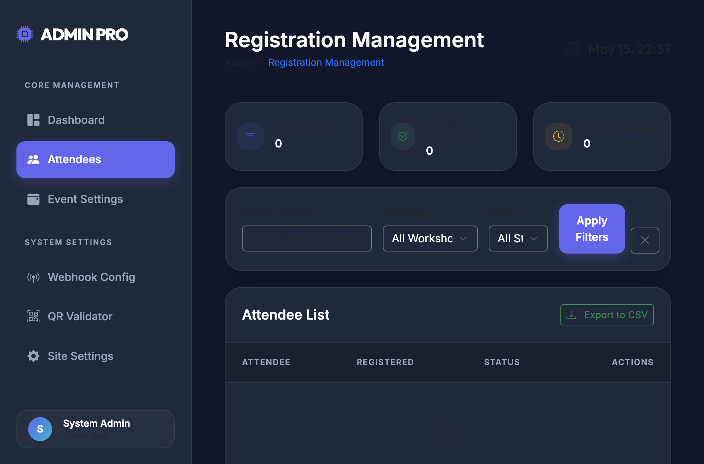
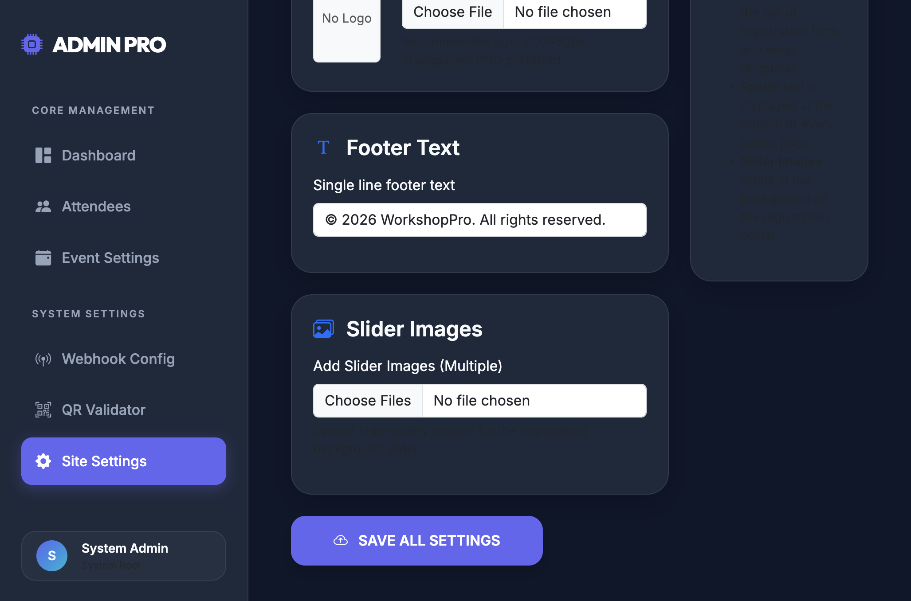
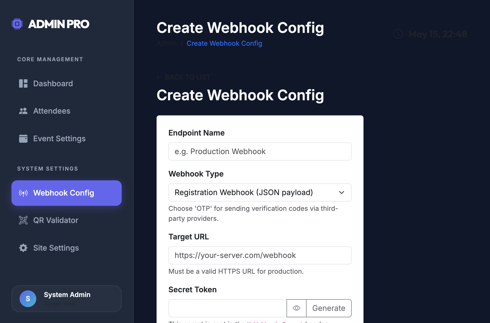
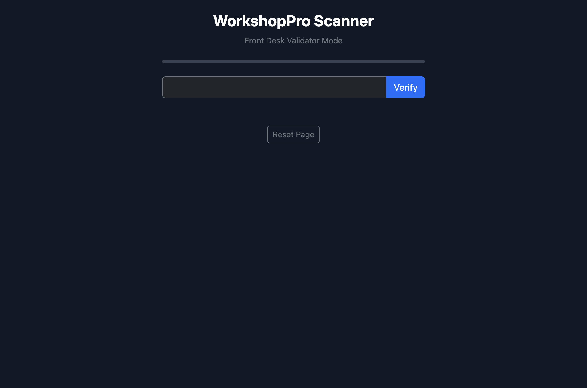

# Dogfood Report: WorkshopPro Admin (Admin UI)

| Field | Value |
|-------|-------|
| **Date** | 2026-05-15 |
| **App URL** | http://127.0.0.1:8000/admin |
| **Session** | admin-ui-2026-05-15 |
| **Scope** | Admin: Dashboard, Attendees, Event Settings (Workshops), Webhook Config, Site Settings; plus QR Validator page linked from Admin |

## Summary

| Severity | Count |
|----------|-------|
| Critical | 0 |
| High | 0 |
| Medium | 5 |
| Low | 3 |
| **Total** | **8** |

## Issues

### ISSUE-001: Low-contrast text makes key info hard to read

| Field | Value |
|-------|-------|
| **Severity** | medium |
| **Category** | accessibility / visual |
| **URL** | Multiple admin pages |
| **Repro Video** | N/A |

**Description**

Secondary text and some labels are too dim against the dark background (e.g. timestamps, helper text, empty-state messages, “completion rate” text). This reduces readability and fails basic contrast expectations.

**Repro Steps**

1. Open Admin Dashboard.
   

2. Open Workshops list (empty state message is barely visible).
   

3. Open Webhook Config list (subtitle + empty state message are barely visible).
   

4. Open Site Settings (subtitle + “Usage Instructions” text are barely visible).
   

---

### ISSUE-002: Attendees filters truncate dropdown text

| Field | Value |
|-------|-------|
| **Severity** | medium |
| **Category** | ux / visual |
| **URL** | http://127.0.0.1:8000/admin/registrations |
| **Repro Video** | N/A |

**Description**

In the filters row, the “All Workshops” and “All Status” dropdowns truncate their selected value (“All Worksho”, “All St”), which looks broken and makes it harder to understand current filters.

**Repro Steps**

1. Navigate to Attendees.
   

2. **Observe:** the dropdown values are clipped.
   

---

### ISSUE-003: Attendees table has no empty-state guidance

| Field | Value |
|-------|-------|
| **Severity** | low |
| **Category** | ux / content |
| **URL** | http://127.0.0.1:8000/admin/registrations |
| **Repro Video** | N/A |

**Description**

When there are no attendees, the “Attendee List” table area is blank with no message (e.g. “No attendees yet”) and no call-to-action (e.g. “Create a workshop”, “Share registration link”, etc.).

**Repro Steps**

1. Navigate to Attendees with an empty database.
   

2. **Observe:** blank table area; no next step for the admin user.
   

---

### ISSUE-004: Site Settings “Usage Instructions” content is effectively invisible

| Field | Value |
|-------|-------|
| **Severity** | medium |
| **Category** | accessibility / content |
| **URL** | http://127.0.0.1:8000/admin/settings |
| **Repro Video** | N/A |

**Description**

The “Usage Instructions” panel exists but the body text is so low-contrast that it looks empty, defeating its purpose.

**Repro Steps**

1. Navigate to Site Settings.
   

2. **Observe:** instruction bullets are barely readable.
   

---

### ISSUE-005: Webhook “Secret Token” icon button lacks a visible label

| Field | Value |
|-------|-------|
| **Severity** | medium |
| **Category** | accessibility / ux |
| **URL** | http://127.0.0.1:8000/admin/webhooks/create |
| **Repro Video** | N/A |

**Description**

In “Create Webhook Config”, the eye icon button next to “Secret Token” has no visible label and reads as an unlabeled icon action. This hurts discoverability and accessibility (screen readers, keyboard users).

**Repro Steps**

1. Navigate to Add Config.
   

2. **Observe:** unlabeled eye icon button next to Secret Token.
   

---

### ISSUE-006: Duplicate page titles create visual noise

| Field | Value |
|-------|-------|
| **Severity** | low |
| **Category** | content / ux |
| **URL** | Multiple admin pages |
| **Repro Video** | N/A |

**Description**

Several pages show the page title twice (header + in-page H1), which adds clutter and pushes useful content down.

**Repro Steps**

1. Open Workshops.
   

2. Open General Settings.
   

3. Open Webhook Configurations.
   

---

### ISSUE-007: QR Validator page lacks clear input label and user guidance

| Field | Value |
|-------|-------|
| **Severity** | low |
| **Category** | ux / accessibility |
| **URL** | http://127.0.0.1:8000/validate?key=... |
| **Repro Video** | N/A |

**Description**

The QR Validator page has a single input without a visible label or instructions (relies on placeholder). The page also has large unused space and no guidance for the expected token format or where to find it.

**Repro Steps**

1. Open QR Validator from the admin sidebar.
   

2. **Observe:** input has no visible label; no “how to use” guidance.
   

---

### ISSUE-008: Site Settings file inputs use default browser styling (inconsistent with theme)

| Field | Value |
|-------|-------|
| **Severity** | low |
| **Category** | visual / ux |
| **URL** | http://127.0.0.1:8000/admin/settings |
| **Repro Video** | N/A |

**Description**

The logo/slider file inputs render as default white browser controls, which clashes with the dark admin theme and feels unpolished.

**Repro Steps**

1. Navigate to Site Settings.
   

2. Scroll to Slider Images.
   

---
